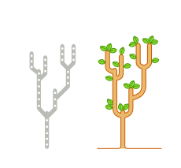
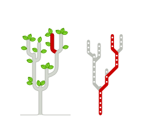
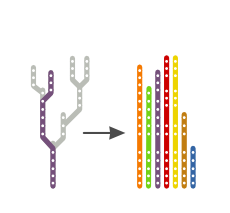
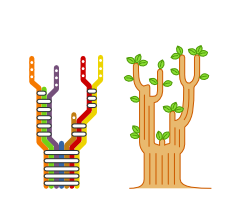

Context Matters
===============

Limitations of the tree model
-----------------------------




### An error-prone tree representation of Git repositories


- Git repositories are often represented as skinny trees
- That's useful to visualize how branches are related
- But that compact representation is also error-prone
- And can lead to mistakes when working with branches



### Git branches are not tree branches


- Git branches go far beyond tree branches because they do extend down to the repository intial commit

```bash
git log --oneline purple

3af45d44 Add purple feature
985d3ea3 ...
...      ...
96bb4c78 Initial commit
```



### All Git branches contain the initial commit




### A more accurate tree representation


----


License
-------

    This article is part of the Gardening with Git series.

    Copyright (C) 2014, 2015 Gonzalo Bulnes Guilpain
    Please refer to the series LICENSE for copying conditions.

