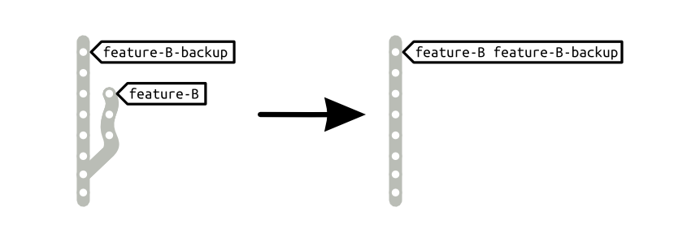

Restore a branch from a backup
==============================

After modifying a branch in a irreversible way, restoring it from a backup allows to undo the modifications.

_Branches are kind of tags which get updated automatically when you add commits. Restoring a branch from a backup may be seen as moving the branch name tag to the head of the backup branch. That can be done by deleting the branch, then re-creating it in the context of the backup branch._



Mechanics
---------

1. Delete the messed-up branch (may require forcing the deletion)
1. Re-create the deleted branch in the context of the backup branch

Example
-------

```bash
# delete the messed-up branch
git branch -d feature-B # you may need the -D flag

# re-create the branch in the context of the backup
git branch feature-B feature-B-backup
```

See Also
--------

- How-to [backup a branch](backup_a_branch.md)


License
-------

    This how-to is part of the Gardening with Git series.

    Copyright (C) 2013, 2014, 2015 Gonzalo Bulnes Guilpain
    Please refer to the series LICENSE for copying conditions.
