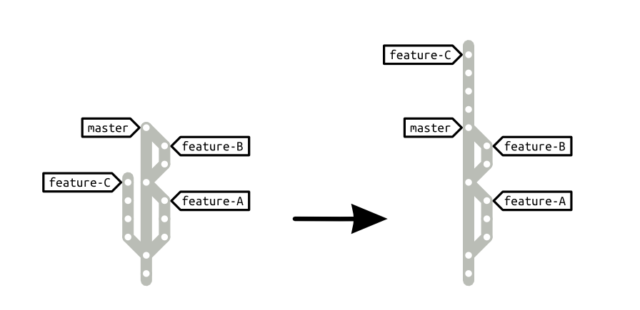

Update the context of a branch
==============================

In the time the feature you're working on was written, the branch you want to merge into was modified. In order to detect possible incompatibilities before performing the merge, you want the context of you feature to be updated.

_Rebase the branch you're working on top of the branch you plan to merge it into. Please do notice that [performing a backup of the branch][backup] that you will rebase is strongly reommended._



Motivation
----------

The feature you're working on may be incompatible with the modifications of the branch you plan to merge it into. Incompatibilities can raise conflits or not, and can affect your feature, or any feature that modified the branch you plan to merge into.

If the context of your feature is out-of-date, the incompatibilities that do raise conflicts will be solved during the merge, but the corresponding changes will be grouped all together as part of the merge commit, which may rise auditablility issues. The incompatibilites that do not raise any conflict, on the other hand, won't be fixed until the merge is commited. That's to say that some fixes that make the feature viable in its new context won't be part of the feature branch, making collaboration harder.

Updating the branch context, on the contrary, allows the feature branch to hold all the commit that are required for the feature to be complete in the context in which it will be shipped. That results in fast-forward merges (empty merge commits) and easier collaboration through readable Git repositories.

Mechanics
---------

1. Clean your workspace (there should be no uncommitted changes around)
1. [Backup the branch][backup] that you'll rebase (optional but strongly recommended)
1. Rebase the out-of-date feature branch onto the branch you plan to merge it into.

Example
-------

The `feature-C` branch should be merged into `master`. But the branch was created a while ago and two other features were actually merged into master since then. Let's update the `feature-C` context to make sure any incompatibilites with `feature-A` or `feature-B` can be fixed before merging.

```bash
# make sure your working space is clean
# optionally you can do it by stashing eventual changes
git stash

# update the feature context with the newest master changes
git checkout feature-C
git rebase master # may raise conflicts, solve them as they appear

# optionally restore the stashed changes
git stash pop
```

See Also
--------

- How-to [backup a branch][backup]

  [backup]: backup_a_branch.md

License
-------

    This how-to is part of the Gardening with Git series.

    Copyright (C) 2013, 2014, 2015 Gonzalo Bulnes Guilpain
    Copyright (C) 2015 Acid Ltda.
    Please refer to the series LICENSE for copying conditions.
